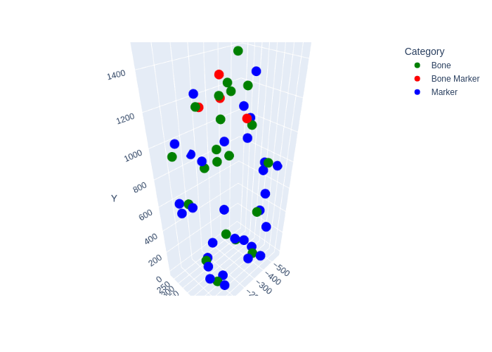
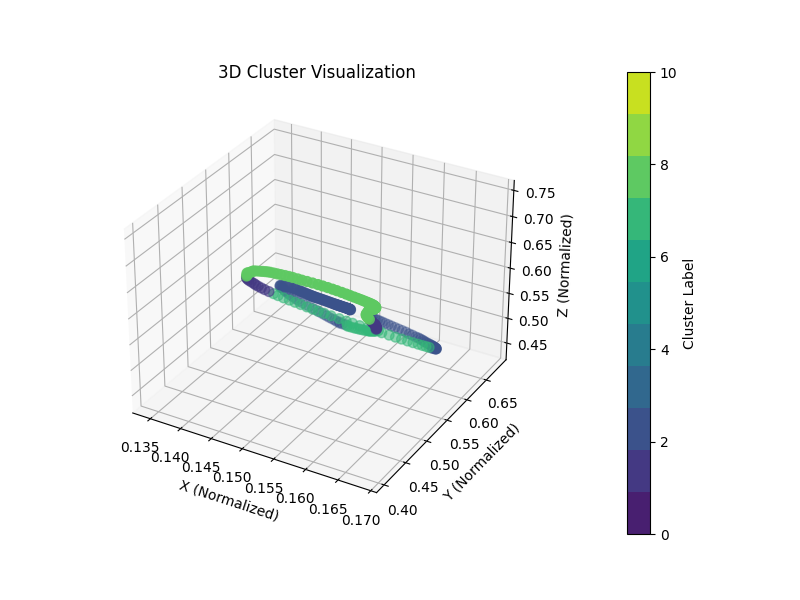

# SEMINAR & PRACTICAL WORK

## Human Activity Recognition (HAR) of Industrial Work Tasks

### Objective of Seminar

The objective of the seminar is to teach and practice scientific methods by
studying advanced topics of Artificial Intelligence. Students have to work on a
certain part of the seminar topic independently, do literature research, and
present and discuss their insights, findings, and results to an audience.

### Objective of Practical work

The goal of this practical work is to improve practical research skills, such as, understanding,
improving, comparing, and testing published algorithms, analyzing data sets, or solving a more
theoretical problem. Students are required to understand a current practical problem in Artificial
Intelligence or a related field and to independently work on solving it computationally or
mathematically. Students are required to present their final results. Implemented source code,
results, and a written report summarizing work and results must be handed in.

---

---

### Capture Equipment

OptiTrack and Motive Software:

- Body Bundle 16xOptiTrack, Prime 13
- Cameras (240FPS@1280x1024)
- Bodysuit, different type of marker sets
- Skeleton Tracking
- Rigid Body Tracking
- Data Exports
- Networking software development kit (SDK) for receiving NaturalPoint data across networks (NatNet).

### Overview

- Use one OptiTrack marker-set model for each recording with a full-body setup (41 Markers), 60 Hz.
- Perform N runs (where N≥8) per student for each activity, with simpler activities requiring N=20 runs.
- Label and annotate activities* (e.g., begin, end of A1; begin, end of A2, etc.).
- Use rotational data from joints/segments.
- Apply machine learning (ML) models.

---

### Data Processing

- Data Parsing
- Setting main coordinate
- Normalization
- K-means algorithm
- Data annotation

---

---

### Models Used

- DSVM - Dual Support Vector Machines
- STGCN - Spatial Temporal Graph Convolutional Network
- LSTM - Long Short Term Memory
- CNN - Convolutional Neural Network

---

# SCRIPTS

### Data Preprocessing

- posture_analysis.py
- data_annotation_stgcn.py

### Model Architectures

- DSVM.py
- LSTM.py
- STGCN.py
- CNN.py

### Training Scripts

- training_DSVM.py
- training_LSTM.py
- training_STGCN.py
- CNN.py

### Testing Scripts

- test_DSVM.py
- test_LSTM.py
- test_STGCN.py
- CNN.py

### Graphs and Figures Generation

- posture_analysis.py
- graphs_from_models.py

---

# HOW TO RUN

#### VERY IMPORTANT BEFORE USE

#### HELP -> EDIT CUSTOM PROPERTIES -> add this:

#### idea.max.content.load.filesize=25000

#### idea.max.intellisense.filesize=25000

### RUN AS PIPELINE

- Scripts will create data_in_use folder and populate it with normalized, annotated data
- Scripts will create figures folder and populate it with graphs
- Scripts will create best_lstm.pth, best_stgcn.pth, best_cnn.pth, best_dsvm.pkl as best model checkpoints
- prepare data in folder ../data
- Install all dependencies
- Tested on Python 3.10
- #### Execute run.py

### RUN AS SINGLE SCRIPT

- prepare data in folder ../data

Execute scripts in this order:

- posture_analysis.py
- training_DSVM.py
- test_DSVM.py
- training_LSTM.py
- test_LSTM.py
- training_STGCN.py
- test_STGCN.py
- data_annotation_stgcn.py
- CNN.py
- graphs_from_models.py